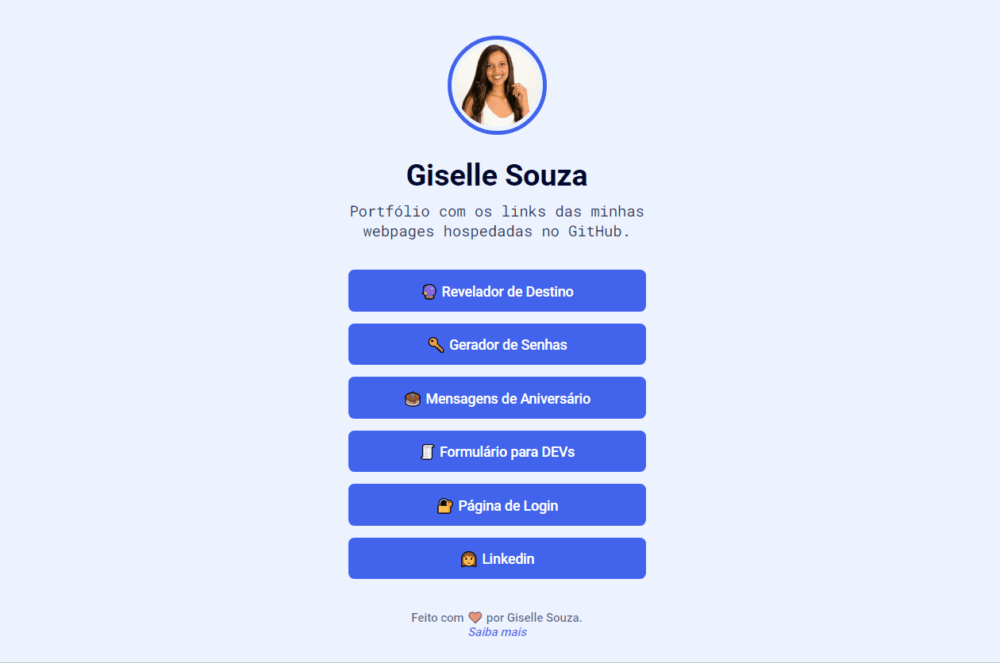

<h1 align="center">Portfólio</h1>

Criei essa webpage para centralizar os links dos meus projetos hospedados no Github.

<h1 align="center">
  
</h1>

---
### Tecnológias

As seguintes ferramentas foram usadas na construção do projeto:

<ul>
    <li>HTML</li>
    <li>CSS</li>
</ul>

---
### Link

  <a href="https://giselle-souza.github.io/portfolio/" target="_blank">Clique aqui</a> para abrir e testar o site.

---

### Autor

Feito com ❤️ por Giselle Souza. 👋,
 

